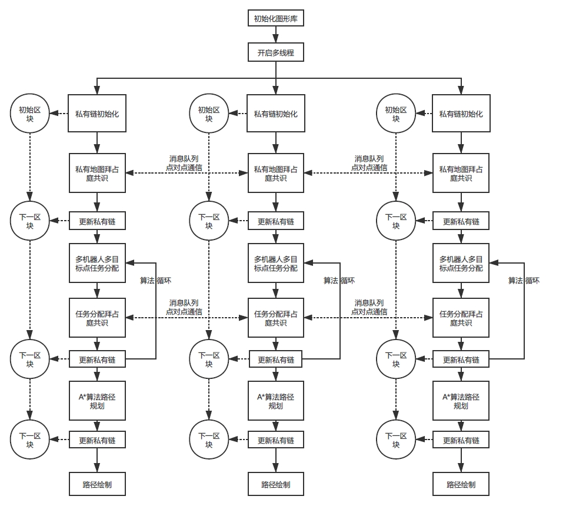

# AI search algorithm with PBFT consensus algorithms in blockchain.
#### Running command:
    python Application.py --filename {map_name} --consensus {True/False}
#### Required parameters:
    --filename: path to maze file [REQUIRED]
#### Optional parameters:
    --consensus: whether use consensus - default False
    --scale: scale - default: 20
    --fps: fps for the display - default 30
    --save: save output to image file - default not saved
    --altcolor: view in an alternate color scheme
    --createMap: whether create Map for each worker - default False
#### Options for map_name:
    armSearch
    bigSearch
    mediumSearch
    openMaze
    smallSearch
    
    Can use --createMap to create additional maps. 
